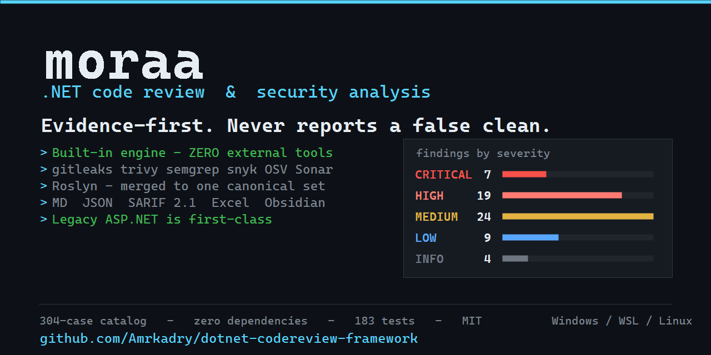

# dotnet-codereview-framework



An evidence-first code-review and security-analysis framework for .NET — built for legacy
ASP.NET Framework (`packages.config`, non-SDK csproj, `Global.asax`, OWIN, EF6, `Web.config`, IIS)
as much as for modern ASP.NET Core.

Four things make it different from a checklist:

1. **A built-in engine that works alone.** `moraa native <path>` produces real findings with NO
   scanner, NO AI and NO network — and every one of the 297 catalog cases applicable to your
   project is either mechanically decided or surfaced as an explicit manual-review item. Nothing
   is silently dropped.
2. **A runnable orchestrator.** `moraa review <path>` runs every available scanner *plus* the
   built-in sources (native engine, NuGet supply-chain, deployed-binary review), reconciles all of
   it into one finding set, and writes the review **into the source tree**.
3. **A catalog of 297 concrete .NET test cases**, organised A–Z, each with the signal to look for,
   the pass condition, which stack it applies to, and whether a tool can decide it.
4. **A canonical JSON model** where Markdown, JSON, SARIF and Excel are *generated* projections —
   so the executive summary, the security report, the CI feed and the risk register cannot
   disagree with each other.

Its governing rule: **no tool is authoritative, including the AI.** Every finding records the tools
that found it *and* the tools that missed it.

---

## Quick start

```bash
# 1. Findings immediately — no scanner, no AI, no network needed.
node bin/moraa.js native /src/MyApp

# 2. What does the project shape permit, and what else could run here?
node bin/moraa.js discover /src/MyApp
node bin/moraa.js tools /src/MyApp

# 3. Full review: every available tool + all built-ins, merged and deduplicated.
#    Writes /src/MyApp/.moraa-review/ (vault + JSON + SARIF + Markdown + Excel).
node bin/moraa.js review /src/MyApp

# 4. What's configured? (every secret redacted to its last 4 characters)
node bin/moraa.js config
```

Output lands **beside the code**, at `<sourcePath>/.moraa-review/`:

```
.moraa-review/
  README.md                       map of content
  00-Executive-Summary.md         overall risk + top priorities
  01-Findings.md                  master table by severity
  02-Tool-Results.md              what ran, what failed, what never looked
  03-Dependencies-Security.md     confirmed advisories
  04-Dependencies-Maintenance.md  outdated / EOL / duplicated
  05-Test-Coverage.md             required tests per finding
  06-Configuration.md
  07-Correlation-and-Dedup.md     which tools agreed, which missed
  08-Remediation-Roadmap.md       P0..P3
  Findings/<ID> <title>.md        one page per finding (AI-report enriches these, in place)
  Manual-Review-Queue.md          catalog cases nothing decided mechanically
  data/report.json                canonical source of truth
  data/report.sarif               SARIF 2.1.0 for code scanning
  data/report.md                  single-file Markdown with stable per-finding anchors
  data/report.excel.xml           Excel workbook (SpreadsheetML 2003): Summary/Findings/Coverage
  data/baseline.json              frozen baseline, after `moraa baseline create`
  data/raw/                       untouched tool output
```

### What a run looks like

The subject below is called **`redacted-source-code`** on purpose: every path, project and
finding in it is synthetic, so the sample can show a full, busy report without disclosing
anything about any real codebase. It is rendered by the same code that prints a real run, so
the frames and bar scaling cannot drift from the tool.

On a terminal this is coloured — severities carry their own colour, bars are tinted to match,
tool rows are green/yellow/red by outcome. Through a pipe it degrades to exactly what you see
here: plain ASCII, **zero ANSI escape bytes**, so CI logs and `grep` stay clean.

```text

  ╭────────────────────────────────────────────────────────────────────────────────────────╮
  │ moraa  ·  .NET code review                                                      v2.1.0 │
  ╰────────────────────────────────────────────────────────────────────────────────────────╯

  source    C:\src\redacted-source-code
  output    C:\src\redacted-source-code\.moraa-review
  platform  Windows  ·  x64

  [1/6] discovering project shape ................................................... 7ms
        └ 4 project(s)  ·  framework  ·  packages.config  ·  no tests  ·  no lockfile
  [2/6] external adapters (8) ...........................................................
  ○ ai-review           not run           
      AI review mode "review" is OFF — it is opt-in and nothing AI-related ran.
  ✔ gitleaks            6 findings        14.2s
  ✔ osv                 9 findings        980ms
  ✔ roslyn              37 findings       41.5s
  ✔ semgrep             23 findings       26.7s
  ✔ snyk                14 findings       8.3s
  ○ sonarqube           not run           
      No SonarQube projectKey configured and no previous analyser output on disk.
  ✔ trivy               11 findings       5.1s
  [3/6] built-in engines ................................................................
  ✔ native              612 findings      3.4s
  ✔ supplychain         28 findings       410ms
  ✔ binary              5 findings        6.9s
  [4/6] normalising .....................................................................
      745 raw finding(s) from 12 source(s)
  [5/6] correlating and deduplicating ...................................................
      588 canonical (merged 157), 34 confirmed by >1 tool
      371 actionable finding(s); 217 catalog case(s) not mechanically decided (manual-review queue)
      consolidated to 63 rule families (folded 308 repeat locations)
  [6/6] writing report ..................................................................

  ╭─ findings by severity ─────────────────────────────────────────────────────────────────╮
  │ CRITICAL      7  ██████████████████░░░░░░░░░░░░░░░░░░░░░░░░░░░░░░░░░░░░░░░░░░░░        │
  │ HIGH         19  █████████████████████████████████████████████████░░░░░░░░░░░░░        │
  │ MEDIUM       24  ██████████████████████████████████████████████████████████████        │
  │ LOW           9  ███████████████████████░░░░░░░░░░░░░░░░░░░░░░░░░░░░░░░░░░░░░░░        │
  │ INFO          4  ██████████░░░░░░░░░░░░░░░░░░░░░░░░░░░░░░░░░░░░░░░░░░░░░░░░░░░░        │
  ╰────────────────────────────────────────────────────────────────────────────────────────╯

  ── highest severity first ────────────────────────────────────────────────────────────────

  CRITICAL   Hardcoded credential literal: password
             → src/DataAccess/<redacted>.cs:1412
  CRITICAL   SQL injection via string concatenation
             → src/DataAccess/<redacted>Repository.cs:268  (+11 more locations)
  CRITICAL   TLS certificate validation disabled process-wide
             → src/Services/<redacted>Client.cs:54  (+2 more locations)
  CRITICAL   <redacted>Controller exposes 6 state-changing endpoint(s) with no authoriz…
             → src/Controllers/<redacted>Controller.cs:37  (+22 more locations)
  CRITICAL   Insecure deserialization of untrusted input (BinaryFormatter)
             → src/Messaging/<redacted>.cs:96
  HIGH       Hard-coded cryptographic key literal (dotnet-weak-static-key)
             → src/Auth/<redacted>Provider.cs:41
  HIGH       Restored package packages/<redacted>.6.5.1 ships MSBuild logic that EXECUT…
             → packages/<redacted>.6.5.1/build/<redacted>.targets:24
  HIGH       Reflected cross-site scripting in a Razor view
             → src/Views/<redacted>/Index.cshtml:73  (+4 more locations)
  HIGH       Server-side request forgery via user-supplied URL
             → src/Services/<redacted>Fetcher.cs:128
  HIGH       PBKDF2 run for only 100 iterations
             → src/Security/<redacted>Hasher.cs:62

  2 further finding(s) in the report

  ── output ────────────────────────────────────────────────────────────────────────────────

  files      78 written to C:\src\redacted-source-code\.moraa-review
  start at   .moraa-review\README.md
  coverage   63 actionable  ·  217 undecided (Manual-Review-Queue.md)
  excel      .moraa-review/data/report.excel.xml
  elapsed    1m52s

  ⚠ 2 source(s) did not run: ai-review, sonarqube
  Findings absent from this report may simply never have been looked for.
```

Reading it:

- **Tool rows** say what each source *did*. `✔` ran, `○` did not. A row that did not run
  carries the reason, because a tool reporting nothing because it never started is not a
  clean result — and the footer repeats which sources were absent for the same reason.
- **The severity chart** keeps empty severities visible and dimmed rather than dropping them,
  so a genuinely clean run cannot be mistaken for a partial one.
- **`(+22 more locations)`** means the rule fired in 23 places and was consolidated into one
  finding family; the other locations are all in the report, not discarded.
- **`coverage`** separates what was decided from what was not. The undecided cases are
  questions in `Manual-Review-Queue.md`, never counted as findings.

### Windows, WSL and Linux

The framework runs natively on all three, and accepts a source path in whichever shell
convention you happen to have copied:

```
moraa review "D:\Projects\App"      # PowerShell / cmd
moraa review /d/Projects/App         # Git Bash on Windows
moraa review /mnt/d/Projects/App     # WSL
```

All three resolve to the same tree. Translation is conservative: a path that already exists
is never rewritten, so a genuine `/mnt` or `/d` directory on a Linux box keeps working, and
a translation that does happen is printed rather than applied silently.

This matters more than it sounds. Passing a Git Bash path to Windows node used to resolve a
directory that does not exist, scan nothing, and still report a confident "0 projects" with
findings derived from that emptiness — a wrong answer wearing the costume of a right one.
Relatedly, a positional `<sourcePath>` that is actually an option is now rejected outright:
`moraa discover --path X` used to analyse a directory named `--path`.

### Installing the scanners

The built-in engine needs nothing, but each absent external tool is a real coverage gap —
with no gitleaks, nothing in the run looks for the credentials in `Web.config` that are the
most common critical finding on .NET. `moraa install` closes that gap for you:

```
moraa install                  # what is missing, and how THIS machine would install it
moraa install --yes            # actually install it
moraa install gitleaks trivy   # just these
moraa install --yes gitleaks   # just this one, for real
```

Recipes are chosen from the package managers actually on your PATH (winget, choco, scoop,
brew, apt, dnf, pacman, pipx, pip, go, npm), so the same command does the right thing on a
Windows laptop and a Debian build agent. Where no manager provides a tool, it is reported as
a manual download with a URL rather than guessed at.

Installing software changes your machine, so **nothing is installed without `--yes`** — the
plan is printed first, every time. Each tool is attempted independently, so one failure does
not abandon the rest, and a manager that exits 0 is not taken at its word: the binary is
probed again afterwards, because an install that lands outside PATH leaves the tool just as
unavailable to a run as no install at all.

### Findings vs the manual-review queue

A run produces two distinct sets, and conflating them is the fastest way to make a report lie.

- **Findings** are things an engine actually decided. They are what the severity line counts,
  what `data/report.json` carries in `findings`, what becomes a page under `Findings/`, and
  the only thing projected into `report.sarif`.
- **The manual-review queue** is every catalog case no automated check reached, emitted as
  `manualReview` in `report.json` and as `Manual-Review-Queue.md`. These are questions, not
  defects: they assert neither a bug nor a clean bill of health.

The queue is usually the larger of the two — on a legacy ASP.NET project, 41 findings alongside
207 undecided cases is normal. They are kept apart for two reasons. A count that mixes them is
meaningless, and SARIF is an *alert* format: a locationless "review this by hand" result becomes
a real alert in GitHub or Azure DevOps code scanning, so hundreds of them bury the findings that
matter. Coverage is still reported in full — it is just reported as coverage.

Severity is likewise graded on evidence rather than presence. A restored NuGet package that ships
`buildTransitive/*.targets` is not a HIGH supply-chain risk because the file exists; practically
every modern package ships one. It is HIGH when the file actually contains an executable MSBuild
construct (`Exec`, `UsingTask`, `DownloadFile`, `WriteCodeFragment`, or a script reference),
and the finding cites the line that proves it. The declarative remainder is rolled up into a
single INFO inventory item.

### Sources

**Built-in (always run in `review`; no external tool, no network):**

| Source | Kind | Notes |
|---|---|---|
| `native` | sast | the framework's own engine: XML config + C# + manifest checks driven by the 305-case catalog; undecided cases become explicit manual-review items — see [docs/36](docs/36-native-engine.md) |
| `supplychain` | dependency | NuGet supply-chain: dependency confusion, feed/credential misconfig, pinning, restore-time execution — see [docs/37](docs/37-supply-chain.md) |
| `binary` | sast | deployed-assembly review (`bin/*.dll`): PE/ECMA-335 metadata, debug builds, binding redirects, redacted embedded secrets — see [docs/38](docs/38-binary-review.md) |

**Adapters (external tools, verified against fixtures without the tool installed):**

| Adapter | Kind | Notes |
|---|---|---|
| `trivy` | dependency | reads manifests, so it works on `packages.config` where `dotnet list package` cannot run |
| `snyk` | dependency | needs auth; preserves the transitive `from` chain, which changes the fix |
| `osv` | dependency | **keyless HTTPS API** (osv.dev querybatch) — real advisory matching with no tool install and no account; complements `osv-scanner`/`snyk` |
| `osv-scanner` | dependency | free, no auth |
| `dependency-check` | dependency | SARIF, reads `packages.config` |
| `gitleaks` | secret | **always** uses the .NET ruleset; refuses to fall back to stock rules |
| `semgrep` | sast | runs the bundled `dotnet-moraa.yaml` |
| `sonarqube` | quality | Web API, plus an **offline mode** that parses `.sonarqube/out/0/Issues.json` |
| `roslyn` | sast | .NET compiler-platform analysis when a build is possible |
| `ai-review` | ai | **two opt-in modes, both off by default** — see below |

### Tool requirements — what to install, and what it buys you

Run `tools/install-tools.ps1 -Local` (Windows) or `tools/install-tools.sh` (Linux/WSL/CI),
then make sure the binaries are on PATH. All are free; none are required — the review
degrades honestly per missing tool, but accuracy measurably improves with them:

| Tool | Accuracy contribution | Auth | Notes |
|---|---|---|---|
| `gitleaks` | **Confirmed secrets** in Web.config/appsettings via our .NET ruleset — the #1 critical class on legacy apps; turns native POSSIBLE heuristics into multi-tool-confirmed findings | none | install script; canary-gated in CI |
| `trivy` | Second advisory database cross-checking the keyless OSV adapter; manifest misconfigs on packages.config apps | none | install script |
| `semgrep` | Pattern-SAST corroboration (rules/semgrep/dotnet-moraa.yaml) | none | Linux/WSL only (upstream); `pip3 install semgrep` |
| `osv` adapter | Live advisory matching | none | keyless API — nothing to install |
| `snyk` | Commercial advisory depth + transitive chains | free account + `SNYK_TOKEN` | `npm i -g snyk && snyk auth` |
| `sonarqube` | Server merge, or offline from a previous `.sonarqube/out/*/Issues.json` (auto-discovered) | token for live API | 840 issues merged on the reference run |
| `roslyn` | Compiler-platform analysis | none | needs a buildable SDK project — NOT_APPLICABLE on legacy packages.config apps |

Measured on the reference run: with gitleaks + trivy installed, 8 of 10 sources execute,
the hard-coded-credentials finding is confirmed by three tools (gitleaks + native + Sonar),
and gitleaks’ .NET ruleset surfaces additional HIGH-severity secrets native heuristics miss.

Every source satisfies one contract and is verified by the test suite **without the real tool
installed**, by parsing a fixture. A status other than `EXECUTED` is structurally
forbidden from carrying findings, which is what makes a false clean impossible to express.

### AI review is optional

It is **off by default** because enabling it transmits source code to a third-party API. Keys are
read from the environment only — `ANTHROPIC_API_KEY`, `OPENAI_API_KEY`, `ZAI_API_KEY` — never from
config files and never from CLI arguments, since `argv` is visible in process listings. AI findings
are capped at confidence `POSSIBLE`, receive no CVSS, and are marked `UNVERIFIED`. Everything else
works fully without it.

With **zero scanners installed** the pipeline still produces a report: discovery alone derived six
findings on a synthetic legacy project, and every absent tool was reported as a capability gap.

See [docs/34-orchestration.md](docs/34-orchestration.md).

---

## The test-case catalog

305 reusable cases across four files. Pull the relevant ids into a review and map them to findings.

- [`catalog/dotnet-test-cases.json`](catalog/dotnet-test-cases.json) — **A–R, 178 cases.** The
  OWASP-aligned core.
- [`catalog/dotnet-test-cases-advanced.json`](catalog/dotnet-test-cases-advanced.json) — **S–Z,
  101 cases.** What is specific to .NET *as a platform*: its serializers, its reflection surface,
  its legacy web stack, its RPC frameworks, the federation protocols it ships clients for,
  HTTP protocol-level issues, and runtime semantics that silently change security decisions.
- [`catalog/dotnet-test-cases-legacy.json`](catalog/dotnet-test-cases-legacy.json) — **LH,
  18 cases.** Legacy ASP.NET Framework / Dynamics idioms ported from a validated code review of a
  42k-line enterprise ASP.NET Framework application (2026-10-08): SSH host-key bypasses, plaintext directory binds,
  PBKDF2 work factors, embedded key/IV material, Dynamics stringified-boolean comparisons,
  unguarded `AppSettings` dereferences, fail-open catches, handler instance state, culture
  round-trips, webroot writes, timestamp filename collisions, denylist sanitization, path
  containment, exception leakage, unchecked `Entities[0]`, cleartext endpoints, verb-less mutating
  actions, and non-revocable token lifetimes. Each case is decided by a `cs-*` check in
  [`src/native/checks/legacy-csharp.js`](src/native/checks/legacy-csharp.js).
- [`catalog/dotnet-test-cases-csharp-hardening.json`](catalog/dotnet-test-cases-csharp-hardening.json) — **CH,
  7 cases.** Gaps mined from Security Code Scan (SCS0001–0034), Microsoft CA security analyzers
  (CA5370/CA5369) and Puma Scan against the A–Z catalog: LDAP distinguished-name injection,
  membership password policy, `DataSet.ReadXml` type restriction, file-existence races (TOCTOU),
  serializer types resolved from input, PowerShell shelled out with composed command text, and
  NTLM credential exposure (manual-review by design). Decided by
  [`src/native/checks/hardening-csharp.js`](src/native/checks/hardening-csharp.js) and the
  `web-membership-policy` config check.

| | Category | Cases |
|---|---|--:|
| A | Authentication and session/token handling | 18 |
| B | Authorization, access control, IDOR, multi-tenancy | 12 |
| C | Input validation and injection | 15 |
| D | Output encoding, XSS, content-type handling | 8 |
| E | Cryptography and secrets management | 12 |
| F | Transport security (TLS) | 7 |
| G | Logging, monitoring and sensitive data in logs | 9 |
| H | Error handling and information disclosure | 7 |
| I | File upload, download and path traversal | 9 |
| J | Deserialization and XML (XXE) | 7 |
| K | SSRF and outbound request handling | 6 |
| L | Business logic | 12 |
| M | Third-party integration security | 6 |
| N | Configuration and hardening | 15 |
| O | Dependency and supply-chain management | 8 |
| P | Concurrency, resources and availability | 11 |
| Q | Data protection, privacy and regulatory | 7 |
| R | Code-quality signals that carry security weight | 9 |
| **S** | **Unsafe reflection, type resolution and dynamic code execution** | **14** |
| **T** | **ASP.NET platform internals** (ViewState, crypto endpoints, path APIs, impersonation) | **14** |
| **U** | **Template injection and runtime compilation (SSTI)** | **8** |
| **V** | **WCF, SOAP and legacy service stacks** | **9** |
| **W** | **Modern .NET surfaces** (SignalR, gRPC, Blazor, Minimal API, hosted services) | **16** |
| **X** | **Federation protocols** (OAuth 2.0, OpenID Connect, SAML) | **14** |
| **Y** | **HTTP protocol-level attacks** (smuggling, host header, cache poisoning, splitting) | **11** |
| **Z** | **Runtime and platform semantics that change security outcomes** | **15** |

Each case is tagged with what can honestly be automated:

| Automatability | Cases | Meaning |
|---|--:|---|
| `DETERMINISTIC` | 212 | a rule can decide it reliably |
| `MANUAL` | 32 | needs business context |
| `DYNAMIC` | 19 | only a running system settles it |
| `AI_ASSISTED` | 16 | needs cross-file or domain reasoning; propose, human confirms |

By stack: 222 apply to both, 41 are ASP.NET Framework specific, 16 are ASP.NET Core specific.
By priority: 96 critical, 114 high, 64 medium, 5 low.

### Is it exhaustive? No — and that is measurable

`tools/audit-coverage.js` probes the catalog against a maintained list of known-dangerous .NET
APIs, frameworks and attack classes, and **prints what is not covered**:

```bash
node tools/audit-coverage.js            # report gaps (exits 0 — gaps are backlog)
node tools/audit-coverage.js --strict   # fail CI on any gap
```

```
test cases    : 304
categories    : 26
probes        : 147
covered       : 147
gaps          : 0
coverage      : 100.0%
```

**100% means "no *known* gaps", never "exhaustive."** The tool cannot know about a surface nobody
has added a probe for, and it audits *breadth* of classes rather than *depth* within a class. Add a
probe whenever you learn of a surface the catalog should cover — a failing probe is a backlog item,
not an error.

Categories S–Z exist because this audit was run against the A–R catalog and **37 of 47 probed
surfaces came back missing** — including ViewState deserialization RCE, padding-oracle exposure,
`Type.GetType` injection, `XamlReader.Parse`, SAML signature wrapping, host-header reset poisoning,
request smuggling, and culture-sensitive comparison bypass. Asking the question with a tool found
gaps that reading the catalog did not.

Known remaining thinness, stated rather than hidden: ADCS and Kerberos delegation, Azure-specific
identity misuse, side-channel and crypto oracles beyond padding, SQL Server-side permissions and
stored-procedure bodies, and desktop/mobile .NET (WPF, MAUI).

A sample case:

```json
{
  "id": "G-002", "category": "G",
  "title": "Log directory inside the webroot",
  "lookFor": "Path.Combine(AppDomain.CurrentDomain.BaseDirectory, \"Logs\") or ContentRootPath sinks",
  "expected": "log path outside the served root; deny rule as defence in depth",
  "stack": "both", "type": "unit", "priority": "critical",
  "automatable": "DETERMINISTIC", "cwe": "CWE-552"
}
```

---

## Canonical model

The canonical JSON is the **single source of truth**. Every other artifact is a projection and may
never contain a fact absent from it.

```
reviews/<id>/findings-*.json          <-- authored / AI-assisted, schema-validated
            |
            v   tools/project-findings.js
            |
  +---------+----------+-----------------+
  |                    |                 |
report.json        report.sarif      reports/*.md
(machine)          (CI code-scanning) (exec, security, deps, tests, config, roadmap)
```

Schema: [`schema/finding.schema.json`](schema/finding.schema.json).

```bash
node tools/project-findings.js reviews/example    # -> report.json, report.sarif, reports/*.md
node tools/validate-crossrefs.js reviews/example  # catalog + finding-reference integrity
node tools/generate-docs.js                       # -> docs/01..33
```

The projection **fails the build** on integrity violations: duplicate finding ids, a finding with no
`sources`, a malformed CVSS vector, a CVSS score attached to a non-scoreable category, or a
suppression with no expiry date.

### Why the schema looks the way it does

- **`sources[]` records misses, not just hits.** `status` may be `REPORTED`, `MISSED`,
  `FALSE_NEGATIVE`, `NOT_RUN` or `CONTRADICTED`. This is what makes tool disagreement visible instead
  of averaged away.
- **`cvss` is nullable and that is load-bearing.** Architecture, testing and process findings carry
  `cvss: null`, and the projection enforces it. See [docs/30-cvss.md](docs/30-cvss.md).
- **`severity` may differ from CVSS base severity**, but only with a written `severityRationale`.
- **`confidence` is separate from severity.** A defect can be CONFIRMED while its exploit path is
  only POSSIBLE.
- **`conditionalScore`** holds the "if this precondition proves true" score without ever reporting it
  as the headline.
- **`verification.disproofAttempt`** records what was done to *break* the finding. A finding nobody
  tried to disprove is not validated.
- **`correlation.mergedFrom`** is how three tools reporting one vulnerability stay **one** finding
  instead of inflating the count.

---

## Two independent dependency queues

An old package is not automatically a vulnerability, and a current package can still carry one.
These never merge into a single number.

```
SECURITY                          MAINTENANCE
├── confirmed advisory            ├── outdated / behind latest
├── CVE + CVSS + fixed version    ├── EOL / deprecated / unmaintained
├── exploitability in THIS app    ├── duplicated capability
└── upgrade + regression tests    └── licence risk, version drift
```

When the SECURITY queue is empty because no scanner could run, the generated report says exactly
that rather than implying a clean bill of health.

---

## Custom rules, because defaults are not enough on .NET

### Secret scanning

[`rules/gitleaks/dotnet-config.toml`](rules/gitleaks/dotnet-config.toml) — because **stock gitleaks
rules miss how .NET actually stores secrets.**

Measured on a real legacy ASP.NET Framework application: stock rules scanned 49.18 MB and reported
**"no leaks found"** on a tree containing four sets of live cleartext passwords. The default rules
target high-entropy cloud tokens (`AKIA…`, `ghp_…`, PEM blocks, JWTs), not low-entropy passwords in
XML attributes such as `<add key="AdminPassword" value="..." />`. The .NET ruleset found **17**.

Covers: connection-string passwords, secret-bearing `appSettings`, **credentials left in XML
comments**, inline credential assignment in C#, and weak static key literals.

```bash
gitleaks dir . --config rules/gitleaks/dotnet-config.toml --redact \
         --report-format sarif --report-path gitleaks.sarif --exit-code 1
```

Always pair it with a **canary** (see [`ci/github-actions.yml`](ci/github-actions.yml)) so "clean"
cannot silently mean "not looking".

### Static analysis

[`rules/semgrep/dotnet-moraa.yaml`](rules/semgrep/dotnet-moraa.yaml) — 22 rules for the
deterministic findings: reflected-Origin CORS, disabled certificate validation, zero IV, weak KDF
iterations, SSH host-key bypass, body logging, webroot log paths, path traversal, missing
empty-password guards, unconditional Swagger, expression injection, fail-silent `catch` blocks,
culture-sensitive money formatting, untimed regexes, sync-over-async.

Rules for `AI_ASSISTED` findings are deliberately **absent** — a rule that half-detects them produces
noise instead of signal.

---

## Capability detection matters

The framework must never report a clean result it never obtained. Two verified examples:

| Situation | Naive behaviour | Correct behaviour |
|---|---|---|
| `dotnet list package --vulnerable` on a non-SDK web project | reports nothing → looks clean | **FAILED**: the SDK lacks `Microsoft.WebApplication.targets`, and the command does not support `packages.config`. Use OWASP Dependency-Check or Trivy, which read the manifest directly. |
| A SAST tool installed but unlicensed | "executed, 0 findings" | **FAILED**: `Invalid license file`. Zero findings from a tool that never ran is not a result. |

Status vocabulary for every command and tool: **EXECUTED**, **FAILED**, **NOT AVAILABLE**,
**NOT APPLICABLE**, **UNVERIFIED**.

---

## Phases

| # | Phase | Output |
|--:|---|---|
| 1 | Project discovery — solution, projects, framework, entry points, config, CI, containers, VCS | architecture map |
| 2 | Build & test verification | status per command with exit codes |
| 3 | Tool execution — with **capability detection** per project shape | `reports/11-tool-results.md` |
| 4 | Ingest prior outputs — other AI runs, analyzers, scanners | normalized inventory |
| 5 | Normalization — canonical ids, schema validation | `findings-*.json` |
| 6 | Correlation & dedup | `correlation.mergedFrom` |
| 7 | **Adversarial validation** — try to disprove every finding | `verification.*` |
| 8 | Projection — Markdown + JSON + SARIF | `reports/`, `report.json`, `report.sarif` |

Phase 7 is the one most pipelines omit. On the reference run it corrected 3 findings, strengthened 2
and clarified 2 — all three corrections came from the same mistake: **assuming a dangerous-looking
construct was on a live path.** Two were not (dead code, an unreachable limit) and one had the wrong
mechanism entirely. A grep hit is evidence of a *pattern*, not of *reachability*.

---

## Tools and AI are complementary, in both directions

From the reference run, stated plainly because both halves matter:

- **Review found what tools missed.** SonarQube reported 840 issues across 51 rules — and none of the
  four Critical security findings. Its real contributions were narrow but genuine: a hard-coded
  credential, a static IV, 13 untimed regexes, a shared-field concurrency defect. Missing
  authorization, reflected CORS and disabled TLS validation were all invisible to it, and it never
  reads `Web.config` at all because it analyses compiled code.
- **A tool's confident zero was simply wrong.** Stock gitleaks: 0 findings on a repository with four
  live credential sets.
- **And the AI was wrong too.** Three findings had materially incorrect reasoning until an
  adversarial pass caught them.

Run both. Label both. Validate both.

---

## Repository layout

```
dotnet-codereview-framework/
├── README.md
├── bin/moraa.js                        the orchestrator CLI
├── scripts/validate.{ps1,sh}           validate install + report tool support
├── catalog/
│   ├── dotnet-test-cases.json          178 cases, A-R (OWASP-aligned core)
│   └── dotnet-test-cases-advanced.json 101 cases, S-Z (.NET platform specifics)
├── schema/finding.schema.json         canonical contract
├── tools/
│   ├── project-findings.js            canonical -> md + json + sarif, with integrity gate
│   ├── selfcheck.js                   12-gate whole-framework check
│   ├── test-adapters.js               adapter contract harness (no tools needed)
│   ├── test-correlation.js            proves multi-tool dedup
│   ├── validate-crossrefs.js          catalog + finding-reference integrity
│   ├── audit-coverage.js              probes the catalog and PRINTS THE GAPS
│   ├── generate-docs.js               docs/01..33
│   └── summarize-gitleaks.js          gitleaks report roll-up
├── rules/
│   ├── gitleaks/dotnet-config.toml    .NET config-secret rules
│   └── semgrep/dotnet-moraa.yaml      22 deterministic .NET rules
├── reviews/example/                   synthetic worked example (no real application)
├── reports/                           generated views
├── ci/github-actions.yml              blocking gates + secret-scan canary
└── docs/01..33                        methodology, one topic per file
```

Every doc follows the same nine sections: What · Why · How · What To Test · What Can Be Automated ·
What Requires Manual Review · Common Failure Modes · Example · Remediation.

---

## Worked example

[`reviews/example/`](reviews/example/) is **synthetic** and describes no real application. It exists
so the pipeline runs end to end and so every schema feature has a worked example: a CVSS-scored
finding, a deliberately `null` one, a severity/CVSS divergence with a written rationale, a
`conditionalScore`, a tool false negative, and an `ACCEPTED_RISK` with an expiring suppression.

---

## Licence

MIT.

## Author

**Amr Kadry** — [github.com/Amrkadry](https://github.com/Amrkadry)

Framework design, detection engine, catalog, adapters and AI integration by Amr Kadry.
Third-party rule catalogs mined with attribution in-file: Security Code Scan (SCS rules),
Microsoft CA security analyzers, Puma Scan, SonarQube (S-rules), gitleaks, OWASP.
Licensed MIT — see [LICENSE](LICENSE).
